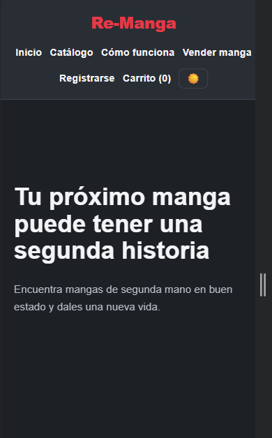
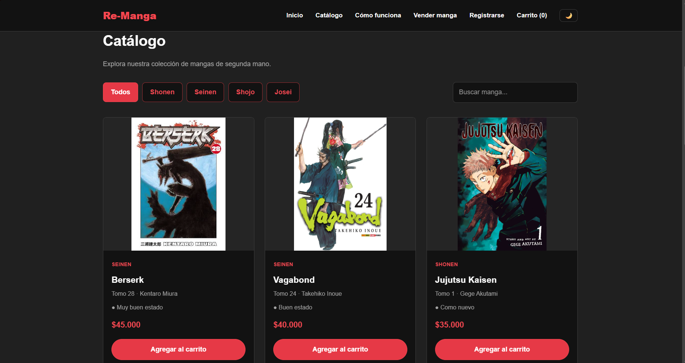
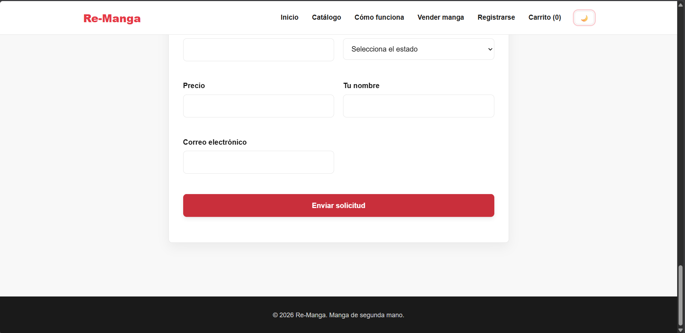
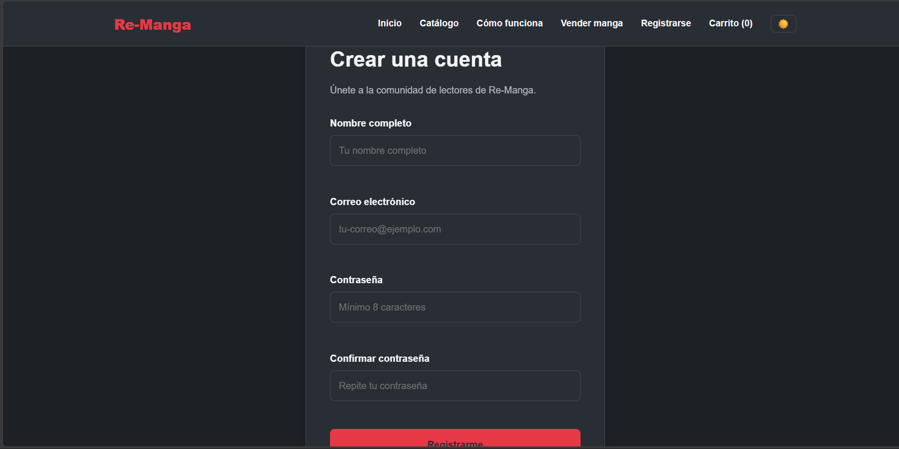
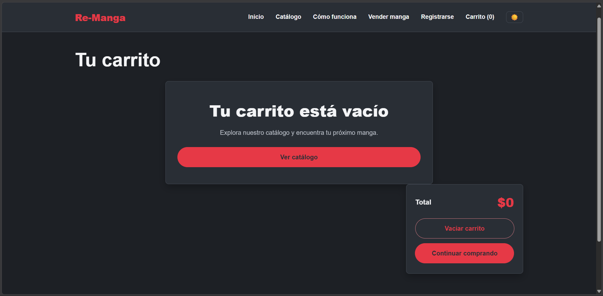
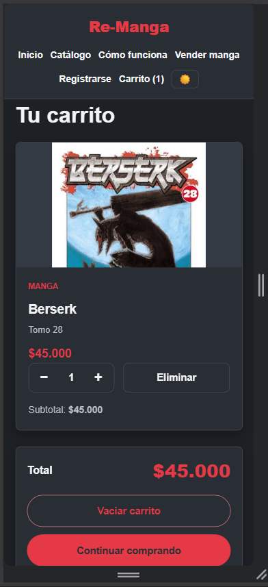
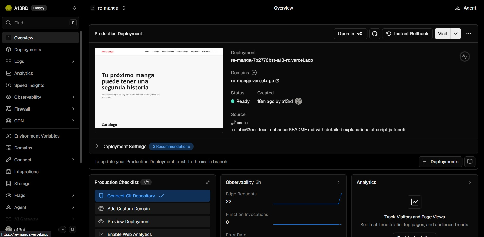

# Re-Manga

Re-Manga es un proyecto académico de tienda web para la compra y venta de mangas de segunda mano. Permite explorar un catálogo, filtrar y buscar títulos, registrarse como usuario, gestionar un carrito de compras y enviar solicitudes para vender mangas propios.

## Tecnologías utilizadas

- HTML5
- CSS3
- JavaScript (vanilla)
- LocalStorage

## Funcionalidades

- Catálogo dinámico de mangas generado desde JavaScript.
- Búsqueda de mangas por título.
- Filtros por género (Shonen, Seinen, Shojo, Josei).
- Botón "Ver más" para cargar más resultados progresivamente.
- Registro de usuarios con validación de formulario.
- Carrito de compras (agregar, aumentar/disminuir cantidad, eliminar, vaciar).
- Persistencia de carrito, usuarios y tema mediante localStorage.
- Modo oscuro / claro.
- Formulario para enviar solicitudes de venta de mangas.
- Diseño responsive.

- Animaciones simples sobre las cards del catalogo y al cargar cada pagina

## Estructura del proyecto

```
Re-Manga/
│
├── index.html        # Página principal
├── registro.html     # Registro de usuarios
├── carrito.html      # Carrito de compras
├── styles.css        # Estilos y diseño visual
├── script.js         # Lógica y funcionalidades
├── images/           # Imágenes de los mangas
└── README.md         # Información del proyecto
```

## Explicación de archivos

### `index.html`

Página principal de Re-Manga.

Contiene las diferentes secciones de la página:

- `header` y `nav`: navegación entre las páginas y secciones.


- `section#hero`: presentación inicial de la página.



- `section#catalogo`: filtros, búsqueda y catálogo de mangas.



- `section#como-funciona`: explicación del funcionamiento de la página.


- `section#vender`: formulario para vender mangas.


- `footer`: información final de la página.

Las tarjetas del catálogo no están escritas directamente en HTML, sino que son generadas mediante JavaScript.



### `registro.html`

Página utilizada para registrar nuevos usuarios.

Contiene un formulario con los campos necesarios para el registro y mensajes para mostrar errores o confirmar que el registro fue exitoso.



### `carrito.html`

Página donde se muestran los mangas agregados al carrito.



Permite modificar cantidades, eliminar productos, vaciar el carrito y consultar el valor total de la compra.



### `script.js`

Archivo encargado de la funcionalidad y la interacción de la página. Contiene las funciones relacionadas con el catálogo, carrito, registro, formulario de venta y modo oscuro.

#### Catálogo

El catálogo se encuentra almacenado en un arreglo llamado `mangas`, donde cada manga tiene información como título, volumen, autor, género, precio, estado e imagen.

La función `mostrarMangas()` se encarga de tomar los mangas disponibles y generar las tarjetas dentro del catálogo.

Cada tarjeta muestra la información del manga y los botones necesarios para interactuar con él, como agregarlo al carrito.

También se utilizan funciones para:

- `normalizarGenero()`: permite manejar los nombres de los géneros de una forma más uniforme.
- `filtrarYMostrarMangas()`: combina la búsqueda y el filtro por género para mostrar los resultados correspondientes.
- `mostrarMangas()`: genera las tarjetas de los mangas y las coloca en el HTML.
- `actualizarBotonVerMas()`: controla si se muestra o no el botón de "Ver más".
- `buscarMangas()`: permite buscar mangas escribiendo su título.
- `filtrarPorGenero()`: permite seleccionar un género específico.
- `verMas()`: aumenta la cantidad de mangas visibles para mostrar más tarjetas.

De esta manera, las tarjetas no tienen que escribirse una por una en el HTML, sino que JavaScript las genera automáticamente a partir del arreglo de mangas.

#### Carrito

El carrito utiliza `localStorage` para guardar los productos seleccionados y mantenerlos aunque se cambie de página.

Las principales funciones son:

- `obtenerCarrito()`: obtiene los productos que están guardados en el carrito.
- `guardarCarrito()`: guarda los cambios realizados en el carrito.
- `actualizarContadorCarrito()`: actualiza el número de productos que aparece junto al botón del carrito.
- `agregarAlCarrito()`: agrega un manga al carrito o aumenta su cantidad si ya existe.
- `eliminarDelCarrito()`: elimina un manga del carrito.
- `cambiarCantidad()`: permite aumentar o disminuir la cantidad de un producto.
- `vaciarCarrito()`: elimina todos los productos del carrito.
- `mostrarCarrito()`: genera y muestra los productos que actualmente están dentro del carrito.
- `actualizarTotalCarrito()`: calcula y muestra el valor total de los productos.

#### Registro de usuarios

El registro utiliza un formulario para obtener los datos del usuario y realizar una validación básica antes de guardarlos.

Las funciones principales son:

- `validarRegistro()`: revisa que los datos ingresados cumplan las condiciones necesarias.
- `registrarUsuario()`: guarda el nuevo usuario en `localStorage` después de validar la información.
- `mostrarMensajeRegistro()`: muestra mensajes de error o confirmación en el formulario.

Los usuarios se almacenan en `localStorage` utilizando la clave `usuarios`.

#### Formulario para vender manga

El formulario de venta permite ingresar la información necesaria sobre un manga que el usuario desea vender.

La función encargada de este formulario obtiene los datos ingresados y muestra el resultado correspondiente.

Actualmente funciona como una simulación en el frontend y posteriormente podría conectarse a una API y una base de datos.

#### Modo oscuro

El modo oscuro permite cambiar entre el tema claro y oscuro de la página.

Las funciones principales son:

- `actualizarBotonTema()`: cambia el icono y el estado del botón según el tema actual.
- El botón de tema agrega o quita la clase `modo-oscuro` del `body`.
- `localStorage` guarda el tema seleccionado para mantenerlo cuando se vuelve a cargar la página.

#### Conexión con HTML

JavaScript se conecta con los archivos HTML utilizando `querySelector`, IDs y clases para encontrar los elementos que necesita modificar.

Por ejemplo:

```javascript
const catalogoGridContainer = document.querySelector("#catalogo-grid");
```

Busca el elemento donde se deben colocar las tarjetas del catálogo.

Después, `mostrarMangas()` genera el contenido y lo coloca dentro de ese elemento.

También se utilizan eventos como `click` y `submit` para detectar las acciones del usuario y ejecutar las funciones correspondientes.

### `styles.css`

Archivo encargado de darle diseño visual a todas las páginas.

Los estilos se aplican utilizando principalmente selectores de elementos, clases e IDs definidos en los archivos HTML.

Por ejemplo:

```css
header { ... }
```

Aplica estilos al encabezado de las páginas.

```css
nav { ... }
```

Organiza y da formato a la barra de navegación.

```css
#hero { ... }
```

Controla la apariencia de la sección principal.

```css
#catalogo-grid { ... }
```

Organiza las tarjetas del catálogo utilizando CSS Grid.

```css
.manga-card { ... }
```

Define el diseño común de cada tarjeta de manga.

```css
.boton-principal { ... }
```

Permite reutilizar el mismo estilo en diferentes botones.

También contiene los estilos para el formulario de registro, carrito, modo oscuro, responsive y las animaciones.


### ¿Cómo se conectan HTML y CSS?

Los archivos HTML conectan el CSS mediante:

```html
<link rel="stylesheet" href="styles.css">

A partir de ahí, las etiquetas, IDs y clases del HTML son utilizadas por styles.css para determinar cómo se ve cada elemento.
```

Por ejemplo:

```html
<section id="catalogo">
```

se estiliza desde CSS mediante:

```css
#catalogo {
    /* estilos de la sección */
}
```
Mientras que una clase reutilizable:

```html
<div class="manga-card">
```

se conecta con:

```css
.manga-card {
    /* estilos de las tarjetas */
}
```

## Decisiones de construcción

- Uso de HTML, CSS y JavaScript vanilla, sin frameworks.
- Catálogo de mangas generado dinámicamente a partir de un arreglo de datos en JavaScript.
- Uso de localStorage para simular persistencia (carrito, usuarios, tema) mientras no hay backend.
- Separación entre estructura (HTML), estilos (CSS) y comportamiento (JavaScript).
- Diseño pensado para adaptarse a distintos tamaños de pantalla.
- Proyecto preparado para conectarse en el futuro a una API REST y una base de datos.
- Uso de Flexbox para alinear elementos en una sola dirección y que se adapten al contenido, como la barra de navegación (`nav`), el hero de bienvenida, los filtros de género y los botones de cada tarjeta del carrito.
- Uso de CSS Grid para organizar contenido en filas y columnas de forma estructurada, como el catálogo de mangas (`#catalogo-grid`), las tarjetas de "Cómo funciona", el resumen del carrito y los campos del formulario de venta.

## Ejecución

Este proyecto es un sitio estático (HTML, CSS y JavaScript) y no requiere instalación de dependencias ni servidor. Puede ejecutarse abriendo directamente el archivo `index.html` en el navegador.

## Despliegue

El proyecto se encuentra desplegado en vercel y conectado en GitHub, [Pagina en Vercel](https://re-manga.vercel.app).



## Futuras mejoras

Actualmente algunas funcionalidades (usuarios, carrito) usan localStorage como solución temporal en el frontend. La idea a futuro es conectar el proyecto a una API REST y una base de datos, especialmente para:

- Usuarios con base de datos, registro de compras o ventas y calificaciones por promedio en ventas;
- Registro con verificacion de correo y direccion de usuario;
- Catálogo por medio de API (Jikan o MangaDex sujeto a cambios);
- Formulario de ventas funcional con base de datos;
- Carrito funcional con relaciones en la base de datos;
- Gestion de inventario.

```
Frontend → API REST → Base de datos
```

---

El desarrollo contó con apoyo de herramientas de inteligencia artificial para tareas de implementación y organización del código.